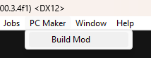
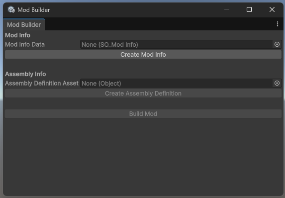
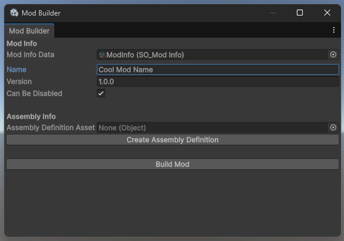

<div align="center">
  
  <h1>+ PC Maker - Modding Toolkit</h1>

  <a href="https://unity.com">
      </a>

  <a href="https://store.steampowered.com/app/3138760/_PC_Maker/">
      </a>

  <a href="">
      </a>

</div>


  <br>


<div>

  <h3><a href="Documentation/Install.md">🎮 Mod Install Guide</a></h3>

  <br>

  <h3><a href="Documentation/API.md">📖 API Documentation</a></h3>
  
  <br>

  <h3><a href="Documentation/Build.md">🔨 Build</a></h3>

  <br>

  <h3><a href="Documentation/Publishing.md">🌟 Publishing</a></h3>

</div>


<br>
<br>


<div>

<h2>🚀 Get Started</h2>
<h3>Install</h3>
<h4>Clone the repository or download it as a ZIP file</h4>

</div>

```bash
git clone https://github.com/Spee2Goon/PC-Maker-Modding-Toolkit
```
or


---

<h3>Begin Development</h3>
<h4>Open Build Mod Window</h4>

<h4>Click on create mod info button</h4>

<h4>Enter name of your mod and then click on Create Assembly Definition button</h4>

<h4>After these steps, you should have a Mod folder containing ModAssemblyDefinition.asmdef and ModInfo.asset</h4>
<h4>Create your scripts only in the Mod folder so that they can be compiled into a single DLL later.</h4>